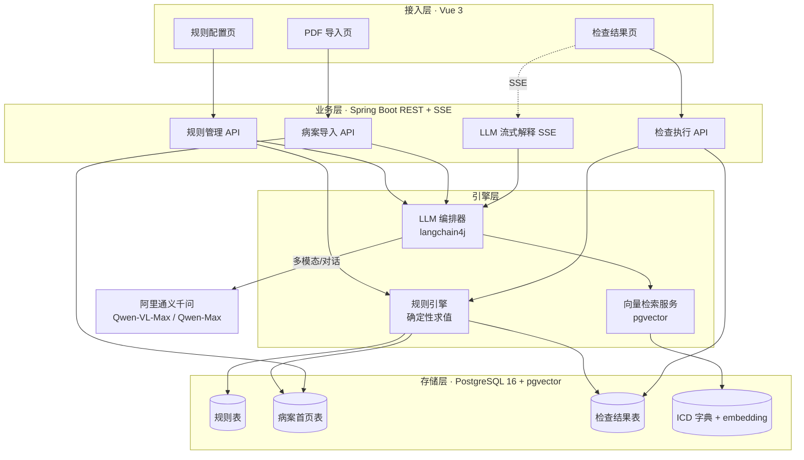
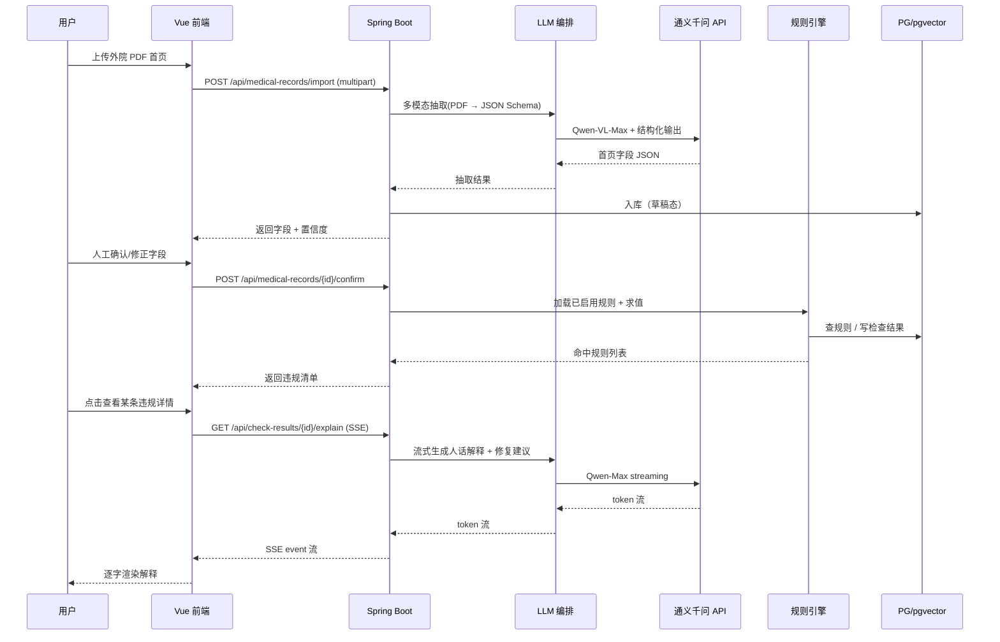
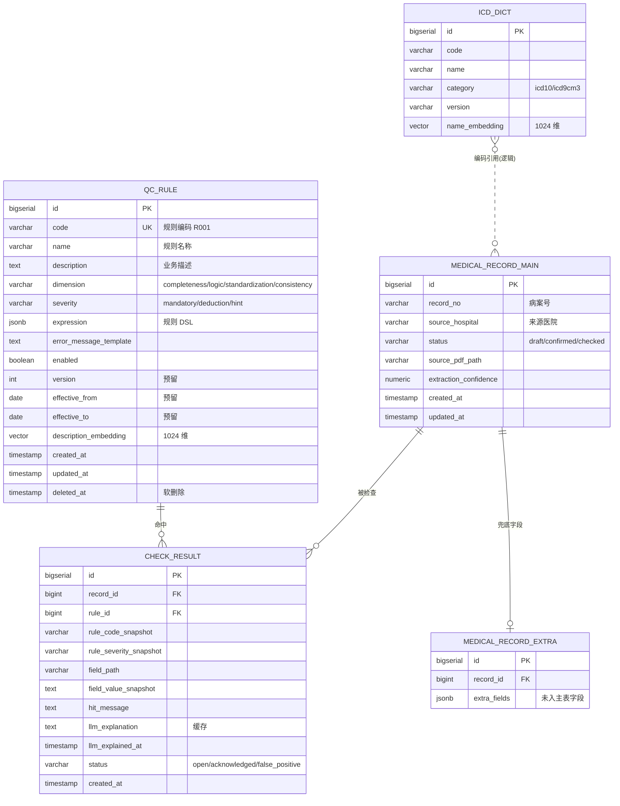
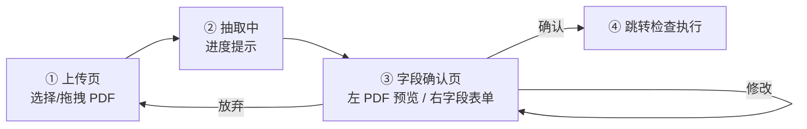
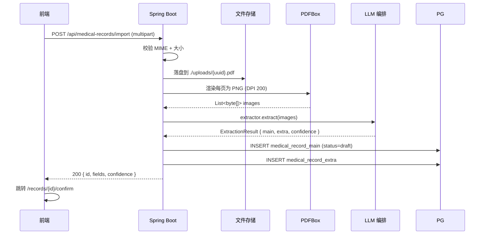
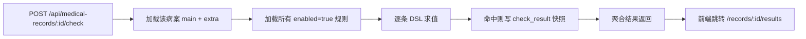
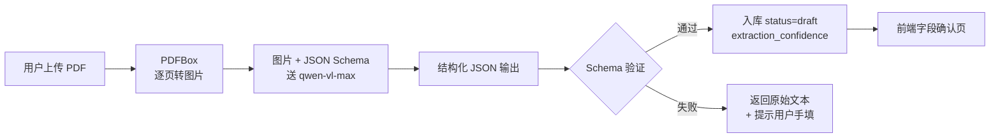

# 病案首页质控 MVP 开发计划书

> **文档定位**：工程实施计划（面向开发团队）
> **范围**：DeepAudit 项目 · 病案首页质控功能模块（独立 MVP）
> **预计交付**：2 个工作日内完成初版可演示系统
> **技术栈**：Vue 3 + Spring Boot + langchain4j + PostgreSQL/pgvector
> **编写日期**：2026-05-03

---

## 1. 背景与目标

### 1.1 业务背景

病案首页是医院信息系统中最具价值的结构化数据之一，是医保支付（DRG/DIP）、国考绩效、卫生统计与法律证据的共同源头数据。详细业务背景参见同目录文档：

- 《病案首页与质控业务.docx》—— 业务详解
- 《病案首页与质控业务_Kickoff_讲稿.docx》—— DeepAudit 项目启动会讲稿

KickOff 讲稿明确指出，传统模式下首页合格率约 60%，而每张错填的首页都可能导致医保扣款、国考失分与法律风险。**DeepAudit 项目的目标是把合格率提升到 95% 以上**。

### 1.2 本模块在 DeepAudit 中的定位

DeepAudit 总体路线图（M1–M4）覆盖完整的"嵌入式质控 + AI 增强"平台建设。本开发计划书聚焦其中一个**独立功能模块的 MVP**：

> **构建一个可演示的病案首页质控原型**，验证"PDF 导入 → 规则配置 → 自动检查 → 结果展示"的完整闭环，并在过程中验证 LLM 在质控场景的三类典型用法（多模态抽取 / 自然语言写规则 / 错误解释生成）。

本 MVP 不替代未来的全平台建设，但为后续 M1（接口清单）、M2（规则引擎落地）、M3（AI 模型落地）提供**可运行的技术骨架**与**可复用的代码资产**。

### 1.3 模块目标（对应需求三件事）

| # | 目标 | 验收口径 |
|---|---|---|
| G1 | 提供可视化的质控规则配置界面，支持新增、修改、停用、（已停用规则的）逻辑删除 | 演示员能在 5 分钟内创建一条新规则并立即生效 |
| G2 | 提供外院 PDF 病案首页导入与字段确认界面 | 上传一份样本 PDF，30 字段抽取置信度 ≥ 0.7，用户可直接确认或修正后入库 |
| G3 | 提供基于已启用规则集的自动检查与结果展示，每一条违规可由 LLM 给出"人话解释 + 修复建议" | 演示样本 PDF 至少触发 2 条规则命中（R1 完整性 + R2 逻辑性），LLM 解释流式输出在 3 s 内首 token 可见 |

### 1.4 非目标（明确不做）

- 不替代现有 HIS / EMR 系统，不写回任何院内核心库
- 不做医保上报通道对接
- 不做规则版本号 + 病案出院日期匹配（数据模型预留，逻辑不实现）
- 不做用户认证与多租户隔离
- 不做高可用/灾备/性能压测

---

## 2. 范围界定

### 2.1 本期做（In Scope）

**功能维度**：

| 模块 | 内容 | 章节 |
|---|---|---|
| 规则配置 | 列表 / 新增 / 修改 / 停用 / 删除（已停用规则） / 测试沙盒 / AI 写规则 / 去重检测 | §5 |
| PDF 导入 | 上传 / 多模态 LLM 抽取 / 字段确认页 / 入库 | §6 |
| 规则检查 | 触发 / DSL 求值 / 结果展示页 / 流式 LLM 解释 / 误报标记 | §7 |

**LLM 用法（4 处）**：

| 链路 | 用途 | 章节 |
|---|---|---|
| L1 | PDF 病案首页字段抽取（Qwen-VL-Max 多模态） | §8.2 |
| L2 | 自然语言转 DSL 规则（Qwen-Max 结构化输出） | §8.3 |
| L3 | 违规命中后的"人话解释 + 修复建议"（Qwen-Max 流式 SSE） | §8.4 |
| V  | ICD 编码语义检索 + 规则去重检测（pgvector + Embedding） | §8.5 |

**规则数量**：MVP 内置 **2 条种子规则**（R1 完整性 + R2 逻辑性），但配置界面与引擎完全支持后续扩展到数百条。

### 2.2 本期不做（Out of Scope）

| 不做的项 | 原因 |
|---|---|
| 接入 HIS / EMR / HRP 系统 | 等 M1 接口清单到位再做；MVP 用 PDF 上传替代 |
| 国考报表 / 医保上报通道 | M4 阶段任务，需对外接口窗口期协调 |
| 规则版本号与时间路由 | 数据模型已预留 `version` / `effective_from` / `effective_to` 字段，逻辑暂不实现 |
| 多用户登录与权限隔离 | 单用户演示模式 |
| 一致性维度规则（跨病程记录比对） | 需要 EMR 接入，本期数据源仅 PDF 首页 |
| 字段级置信度 | LLM 仅返回整体 confidence；字段级在 LLM 编排里有扩展点 |
| 异步任务队列 / Redis 缓存 / k8s 部署 | docker-compose 单机部署足够 MVP |
| 历史规则版本回溯校验 | 需要规则版本号支持 |
| OCR 自研 | 直接使用 Qwen-VL 多模态能力替代传统 OCR |

### 2.3 边界与依赖

| 边界 | 说明 |
|---|---|
| **数据来源** | 仅接受用户手动上传的 PDF 文件（≤ 10 MB / ≤ 5 页） |
| **数据出口** | 仅在 Web 界面展示；不导出报表、不推送外部系统 |
| **外部依赖** | 阿里云通义千问 API（必须）、互联网出口（必须）。失败则进入手填模式 |
| **运行环境** | docker-compose；x86_64；JDK 21；PostgreSQL 16 + pgvector 0.7 |
| **浏览器** | Chrome / Edge 最新两版；不兼容 IE |
| **演示语料** | 项目组准备 1–3 份脱敏样本 PDF + 4.6 万条 ICD 编码字典种子数据 |

### 2.4 验收标准（DoD）

模块视为可交付演示，需同时满足：

1. ✅ docker-compose 一键拉起，前端可访问
2. ✅ 规则配置页可完成 R1/R2 的查看与启停切换
3. ✅ 通过 AI 写规则功能，由自然语言生成至少 1 条新规则并保存
4. ✅ 上传一份样本 PDF，自动抽取并展示字段置信度
5. ✅ 字段确认后触发检查，至少展示 2 条违规命中
6. ✅ 点击违规可看到 LLM 流式生成的人话解释，首 token < 3 s
7. ✅ 规则可被停用，停用后再次检查不再命中
8. ✅ 已启用规则尝试删除时被拦截，提示"请先停用"

---

## 3. 整体架构与技术选型

### 3.1 设计原则

本模块严格遵循 DeepAudit 项目的三条总原则，并针对 MVP 阶段做适度收敛：

1. **事中嵌入** —— 质控关口前移，规则检查在用户上传/确认病案首页后立即执行，不等事后批处理。
2. **旁路只读** —— 不改造任何现有 HIS/EMR 系统，本模块只接受 PDF 上传作为外部输入，所有数据自治。
3. **LLM 增强而非替代** —— 规则引擎仍是确定性主干；LLM 负责难以规则化的环节（PDF 抽取、自然语言转规则、错误解释），且每一处都有降级路径。

MVP 阶段额外约束：**单一当前版本规则集**（数据模型预留版本字段）、**单用户演示模式**（无认证）、**docker-compose 一键部署**。

### 3.2 逻辑架构

四层架构，从上到下职责单向依赖：



**依赖方向**：接入层只依赖业务层；业务层只依赖引擎层；引擎层只依赖存储层和外部 LLM。任意上层不可跨层调用下层。

### 3.3 核心组件清单

| # | 组件 | 职责 | 关键技术 |
|---|---|---|---|
| 1 | **前端 SPA** | 三个核心页面 + SSE 客户端 | Vue 3 + Vite + Element Plus + Pinia + EventSource |
| 2 | **REST API 服务** | 业务编排、参数校验、事务边界 | Spring Boot 3 + Spring Web + Spring Data JPA |
| 3 | **规则引擎** | 加载规则、对首页字段求值、产出违规明细 | 自研轻量引擎（表达式 + Java 函数注册表） |
| 4 | **LLM 编排器** | 三条链路：PDF 抽取 / NL→Rule / 错误解释 | langchain4j（ChatModel、StreamingChatModel、StructuredOutput） |
| 5 | **向量检索服务** | ICD 编码语义检索、规则去重检测 | pgvector + langchain4j Embedding |
| 6 | **存储** | 关系数据 + 向量 | PostgreSQL 16 + pgvector 扩展 |

### 3.4 端到端数据流（PDF 导入 → 检查 → 展示）



### 3.5 技术栈逐项说明

| 层 | 选型 | 版本 | 选型理由 |
|---|---|---|---|
| 前端框架 | Vue 3 + `<script setup>` | 3.4+ | 团队既定 |
| 前端构建 | Vite | 5.x | 启动/HMR 快，2 天 MVP 友好 |
| 前端 UI 库 | Element Plus | 2.x | 表格/表单/抽屉组件齐全，省时间 |
| 前端状态 | Pinia | 2.x | 规则编辑/检查结果跨页共享 |
| 前端流式 | 原生 `EventSource` | — | 接 SSE 端点显示 LLM 流式解释 |
| 后端框架 | Spring Boot | 3.2+ | 团队既定，与 langchain4j 兼容 |
| LLM 抽象 | **langchain4j** | 0.36+ | 统一 ChatModel / EmbeddingModel / StructuredOutput / Streaming 调用，便于切换厂商 |
| ORM | Spring Data JPA + Hibernate | 随 Boot | 省去 SQL 模板代码 |
| 数据库 | PostgreSQL | 16 | 与 pgvector 同生态 |
| 向量扩展 | pgvector | 0.7+ | 与主库同事务，省去额外向量库运维 |
| LLM 厂商 | 阿里通义千问 | qwen-vl-max（多模态）<br/>qwen-max（文本/解释）<br/>text-embedding-v3（向量） | 中文医学文本表现强、OpenAI 兼容协议、langchain4j 已适配；数据合规审查路径清晰 |
| 部署 | docker-compose | — | 一键拉起 PG + 后端 + 前端 + Nginx |

### 3.6 langchain4j 在本架构的角色

langchain4j 是本模块**唯一对接 LLM 的入口**，业务代码不直接调用 HTTP API。它统一承担四种调用形态：

- **ChatModel**（同步）—— 自然语言转规则、ICD 编码消歧
- **StreamingChatModel** —— 错误解释的逐字流式输出（接 SSE）
- **StructuredOutput / JsonSchema 约束** —— PDF 抽取结果按病案首页 schema 强约束输出
- **EmbeddingModel** —— 调 `text-embedding-v3` 把 ICD 字典 / 规则描述向量化

通过 langchain4j 的 `ChatModel` 接口抽象，未来若切换到 Claude / GPT-4V / 本地 vLLM，只需替换 `ChatModelProvider` Bean，不动业务代码。

### 3.7 pgvector 在本架构的角色

pgvector 不是为了堆技术，本 MVP 有两个明确用途：

1. **ICD-10 / ICD-9-CM-3 字典语义检索** —— 规则配置时用户输入"阑尾切除术"，向量检索返回最匹配的几条 ICD-9-CM-3 编码候选，省去人工查码本。
2. **规则去重/相似度检测** —— 用户新增规则时，把规则描述 embed 后与已有规则比对，相似度 > 0.85 时提示"是否与规则 X 重复"。

预留用途（不在 MVP 实现，但表结构留位）：相似历史病案检索、相似违规模式聚类。

### 3.8 关键 REST 接口一览

仅列接口名与用途，详细字段见第 4–7 章。

| 模块 | Method | 路径 | 用途 |
|---|---|---|---|
| 规则管理 | GET | `/api/rules` | 分页列表（含启用状态过滤） |
| 规则管理 | POST | `/api/rules` | 新增规则 |
| 规则管理 | PUT | `/api/rules/{id}` | 修改规则（按已启用策略处理） |
| 规则管理 | DELETE | `/api/rules/{id}` | 逻辑删除规则 |
| 规则管理 | POST | `/api/rules/from-natural-language` | NL 转规则（LLM） |
| 病案导入 | POST | `/api/medical-records/import` | 上传 PDF + 多模态抽取 |
| 病案导入 | PUT | `/api/medical-records/{id}` | 用户确认/修正字段 |
| 检查执行 | POST | `/api/medical-records/{id}/check` | 触发规则检查 |
| 检查执行 | GET | `/api/check-results/{recordId}` | 查询检查结果列表 |
| 检查执行 | GET (SSE) | `/api/check-results/{id}/explain` | 流式 LLM 错误解释 |

### 3.9 与外部系统的边界

**本 MVP 的输入**：用户手动上传的 PDF 文件，**不对接任何院内系统**。

**本 MVP 的输出**：仅展示在 Web 界面，**不向医保 / 国考 / 病案上报通道推送**。

预留接入点（仅在代码层留 SPI 接口，不实现）：
- 上游 EMR / HIS 数据订阅 → 替代 PDF 上传
- 下游医保上报通道 → 替代纯展示
- 第三方 OCR/PDF 解析服务 → 作为多模态 LLM 的备份链路

这样设计的原因：在 KickOff 路线图里，本 MVP 对应 M0/M1 阶段，M2 之后才会接入院内系统；在数据接入正式打通前，PDF 上传是验证规则引擎与 LLM 链路最快的方式。


---

## 4. 核心数据模型

### 4.1 ER 总览

MVP 共 **5 张核心表**，关系如下：



### 4.2 公共约定

| 约定 | 说明 |
|---|---|
| **主键** | 所有表用 `BIGSERIAL`，简单且演示友好。后续可平滑迁雪花 ID。 |
| **审计字段** | `created_at` / `updated_at` 由 JPA `@PrePersist` / `@PreUpdate` 自动维护。 |
| **软删除** | `qc_rule` 表用 `deleted_at` 标记软删除；查询统一带 `WHERE deleted_at IS NULL`。**已启用规则不可硬删除**（处置策略详见 §5.3）。 |
| **快照字段** | `check_result` 中的 `rule_code_snapshot` / `rule_severity_snapshot` / `field_value_snapshot` 是**写时快照**，规则后续修改不影响历史检查结果，可追溯。 |
| **向量列** | 用 pgvector 的 `vector(1024)` 类型，对应通义千问 `text-embedding-v3` 输出维度。建索引：`CREATE INDEX ON qc_rule USING ivfflat (description_embedding vector_cosine_ops)`. |
| **字段命名** | 数据库下划线（`record_no`），Java 实体驼峰（`recordNo`），由 JPA 默认 `SnakeCaseStrategy` 自动映射。 |

### 4.3 `qc_rule` 规则表

完整 DDL：

```sql
CREATE TABLE qc_rule (
    id                       BIGSERIAL PRIMARY KEY,
    code                     VARCHAR(64)  NOT NULL UNIQUE,
    name                     VARCHAR(200) NOT NULL,
    description              TEXT,
    dimension                VARCHAR(20)  NOT NULL CHECK (dimension IN
                                ('completeness','logic','standardization','consistency')),
    severity                 VARCHAR(20)  NOT NULL CHECK (severity IN
                                ('mandatory','deduction','hint')),
    expression               JSONB        NOT NULL,
    error_message_template   TEXT         NOT NULL,
    enabled                  BOOLEAN      NOT NULL DEFAULT TRUE,
    version                  INT          NOT NULL DEFAULT 1,
    effective_from           DATE,
    effective_to             DATE,
    description_embedding    VECTOR(1024),
    created_at               TIMESTAMP    NOT NULL DEFAULT NOW(),
    updated_at               TIMESTAMP    NOT NULL DEFAULT NOW(),
    deleted_at               TIMESTAMP
);

CREATE INDEX idx_qc_rule_enabled    ON qc_rule(enabled) WHERE deleted_at IS NULL;
CREATE INDEX idx_qc_rule_dimension  ON qc_rule(dimension) WHERE deleted_at IS NULL;
CREATE INDEX idx_qc_rule_embedding  ON qc_rule USING ivfflat
                                       (description_embedding vector_cosine_ops);
```

#### 规则 DSL 设计（`expression` 字段）

JSON DSL 支持嵌套布尔运算 + 字段操作 + 可选 `when` 触发条件：

```json
{
  "when":   { "op": "notNull", "field": "mainOperationCode" },
  "assert": {
    "op": "and",
    "args": [
      { "op": "notNull", "field": "operator" },
      { "op": "notNull", "field": "operationDate" }
    ]
  }
}
```

**语义**：`when` 为真时，`assert` 必须为真；否则触发违规。`when` 可省略（无条件断言）。

**支持的操作符**（MVP）：

| 类别 | 操作符 |
|---|---|
| 布尔 | `and`, `or`, `not` |
| 比较 | `eq`, `neq`, `gt`, `gte`, `lt`, `lte` |
| 空值 | `notNull`, `isNull` |
| 集合 | `in`, `notIn` |
| 日期 | `dateBefore`, `dateAfter`, `dateDiffDays` |
| 字符串 | `contains`, `matches` (正则) |

**为什么用 JSON DSL 而不是表达式字符串**：① 前端可可视化树形编辑；② LLM 生成稳定（结构化输出 JSON Schema 约束）；③ 序列化/版本对比/字段重命名工具友好。

#### 两条 MVP 种子规则的 DSL 示例

**R1 — 完整性维度**："有主手术编码时，手术医生与手术日期不能为空"

```json
{
  "code": "R001",
  "name": "手术信息完整性检查",
  "dimension": "completeness",
  "severity": "mandatory",
  "expression": {
    "when":   { "op": "notNull", "field": "mainOperationCode" },
    "assert": {
      "op": "and",
      "args": [
        { "op": "notNull", "field": "operator" },
        { "op": "notNull", "field": "operationDate" }
      ]
    }
  },
  "error_message_template": "病案存在主手术编码 {{mainOperationCode}}，但手术医生或手术日期未填写"
}
```

**R2 — 逻辑性维度**："入院日期必须早于出院日期，且住院天数 = 出院日期 - 入院日期"

```json
{
  "code": "R002",
  "name": "入出院日期与住院天数逻辑校验",
  "dimension": "logic",
  "severity": "mandatory",
  "expression": {
    "op": "and",
    "args": [
      { "op": "dateBefore", "field": "admissionDate", "rhs": { "field": "dischargeDate" } },
      { "op": "eq", "field": "lengthOfStay",
        "rhs": { "op": "dateDiffDays", "from": "admissionDate", "to": "dischargeDate" } }
    ]
  },
  "error_message_template": "入院日期 {{admissionDate}} 与出院日期 {{dischargeDate}} 不一致或住院天数 {{lengthOfStay}} 计算错误"
}
```

### 4.4 `medical_record_main` + `medical_record_extra`

**精选 30 字段策略**：覆盖基本信息 / 入出院 / 主诊主术 / 费用大类，足以支撑两条种子规则与界面展示；未入选的字段统一塞进 `medical_record_extra.extra_fields` JSONB，不丢数据。

```sql
CREATE TABLE medical_record_main (
    id                      BIGSERIAL PRIMARY KEY,

    -- 基本信息（6）
    record_no               VARCHAR(64)  NOT NULL,
    name                    VARCHAR(100),
    gender                  VARCHAR(10),
    birth_date              DATE,
    age                     INT,
    id_card_masked          VARCHAR(32),

    -- 入出院信息（7）
    admission_date          DATE,
    discharge_date          DATE,
    length_of_stay          INT,
    admission_dept          VARCHAR(100),
    discharge_dept          VARCHAR(100),
    admission_route         VARCHAR(50),
    discharge_status        VARCHAR(50),

    -- 诊断（5）
    main_diagnosis_code     VARCHAR(32),
    main_diagnosis_name     VARCHAR(200),
    main_diagnosis_icd_ver  VARCHAR(20),
    other_diagnosis_count   INT,
    pathological_diagnosis  VARCHAR(200),

    -- 手术（5）
    main_operation_code     VARCHAR(32),
    main_operation_name     VARCHAR(200),
    operation_date          DATE,
    operator                VARCHAR(100),
    anesthesia_method       VARCHAR(50),

    -- 费用大类（4）
    total_cost              NUMERIC(12,2),
    drug_cost               NUMERIC(12,2),
    operation_cost          NUMERIC(12,2),
    medical_service_cost    NUMERIC(12,2),

    -- 来源与抽取元数据（3）
    source_hospital         VARCHAR(200),
    source_pdf_path         VARCHAR(500),
    extraction_confidence   NUMERIC(3,2),

    -- 流程状态（1）
    status                  VARCHAR(20)  NOT NULL DEFAULT 'draft'
                            CHECK (status IN ('draft','confirmed','checked')),

    created_at              TIMESTAMP    NOT NULL DEFAULT NOW(),
    updated_at              TIMESTAMP    NOT NULL DEFAULT NOW()
);

CREATE INDEX idx_mrm_record_no  ON medical_record_main(record_no);
CREATE INDEX idx_mrm_status     ON medical_record_main(status);

CREATE TABLE medical_record_extra (
    id              BIGSERIAL PRIMARY KEY,
    record_id       BIGINT NOT NULL UNIQUE
                     REFERENCES medical_record_main(id) ON DELETE CASCADE,
    extra_fields    JSONB  NOT NULL DEFAULT '{}'::jsonb
);
```

**`status` 状态机**：

```
draft  ─[用户确认/修正]─►  confirmed  ─[执行规则检查]─►  checked
                                          ▲
                                          │
                      [用户重新修改]──────┘
```

### 4.5 `check_result` 检查结果表

```sql
CREATE TABLE check_result (
    id                      BIGSERIAL PRIMARY KEY,
    record_id               BIGINT       NOT NULL
                            REFERENCES medical_record_main(id) ON DELETE CASCADE,
    rule_id                 BIGINT       NOT NULL REFERENCES qc_rule(id),

    -- 写时快照：规则后续变更不影响历史结果
    rule_code_snapshot      VARCHAR(64)  NOT NULL,
    rule_name_snapshot      VARCHAR(200) NOT NULL,
    rule_severity_snapshot  VARCHAR(20)  NOT NULL,
    rule_dimension_snapshot VARCHAR(20)  NOT NULL,

    -- 命中详情
    field_path              VARCHAR(200),
    field_value_snapshot    TEXT,
    hit_message             TEXT         NOT NULL,

    -- LLM 解释缓存（首次点击查看时生成并缓存）
    llm_explanation         TEXT,
    llm_explained_at        TIMESTAMP,

    -- 用户处置
    status                  VARCHAR(20)  NOT NULL DEFAULT 'open'
                            CHECK (status IN ('open','acknowledged','false_positive')),

    created_at              TIMESTAMP    NOT NULL DEFAULT NOW()
);

CREATE INDEX idx_cr_record  ON check_result(record_id);
CREATE INDEX idx_cr_rule    ON check_result(rule_id);
CREATE INDEX idx_cr_status  ON check_result(status);
```

**关键设计**：
- **快照字段**：规则名/维度/处置等级在命中时快照入库，规则后续修订不会污染历史结果。
- **LLM 解释懒生成**：用户首次点击"查看详情"时调 LLM 生成并缓存到 `llm_explanation`，避免每条命中都即时调用 LLM 浪费 token。
- **`status` 字段**：支持用户标记"已确认"或"误报"，为未来规则误报率统计预留。

### 4.6 `icd_dict` ICD 编码字典表

```sql
CREATE TABLE icd_dict (
    id              BIGSERIAL PRIMARY KEY,
    code            VARCHAR(32)  NOT NULL,
    name            VARCHAR(500) NOT NULL,
    category        VARCHAR(20)  NOT NULL CHECK (category IN ('icd10','icd9cm3')),
    version         VARCHAR(20)  NOT NULL,   -- 例 "ICD-10 国临版 2.0"
    name_embedding  VECTOR(1024),
    created_at      TIMESTAMP    NOT NULL DEFAULT NOW(),

    UNIQUE (code, category, version)
);

CREATE INDEX idx_icd_category   ON icd_dict(category);
CREATE INDEX idx_icd_embedding  ON icd_dict USING ivfflat
                                  (name_embedding vector_cosine_ops);
```

**种子数据来源**：
- ICD-10：国家临床版 2.0（卫健委发布，CSV 公开）
- ICD-9-CM-3：国家临床版 4.0
- 数据量：约 3.3 万条 ICD-10 + 1.3 万条 ICD-9-CM-3 ≈ **4.6 万条**

**embedding 灌库策略**：
- 启动时执行一次 `EmbeddingSeeder` Bean，对未生成 embedding 的行调用通义千问 `text-embedding-v3` 批量生成（每批 25 条，并发受限于 RPM 配额）
- 一次性灌库耗时估算：4.6 万条 / 25 = 1840 批，按 1 RPS 限制约 30 分钟，**MVP 部署文档需注明首次启动等待时间**。
- 也可以离线预生成 SQL 包随项目交付，跳过运行时灌库（推荐）。


---

## 5. 功能设计 1：规则配置界面

### 5.1 信息架构

规则管理是单页面应用（路由 `/rules`），由 **左主区列表 + 右抽屉编辑** 两块构成：

```
┌────────────────────────────────────────────────────────────┐
│  顶部筛选栏：维度 / 处置等级 / 启用状态 / 关键词搜索        │
├────────────────────────────────────────────────────────────┤
│  规则列表表格（分页）                                       │
│  ┌──────┬────────────┬──────┬──────┬──────┬──────────────┐ │
│  │ 编码 │ 名称        │ 维度 │ 处置 │ 启用 │ 操作         │ │
│  ├──────┼────────────┼──────┼──────┼──────┼──────────────┤ │
│  │ R001 │ 手术信息完整│完整  │强制  │ ✓    │ 编辑 / 停用 │ │
│  │ R002 │ 入出院日期 │逻辑  │强制  │ ✓    │ 编辑 / 停用 │ │
│  └──────┴────────────┴──────┴──────┴──────┴──────────────┘ │
│                              [+ 新增规则]   [+ AI 写规则]   │
└────────────────────────────────────────────────────────────┘

  点击编辑/新增 → 右侧抽屉：
  ┌──────────────────────────────────────┐
  │ Tab1: 基础信息  │ Tab2: DSL 表达式  │
  │ Tab3: AI 写规则 │ Tab4: 测试沙盒    │
  └──────────────────────────────────────┘
```

### 5.2 列表页

**筛选栏**（与表格表头同一行下方）：
- 维度多选：完整性 / 逻辑性 / 规范性 / 一致性
- 处置多选：强制 / 扣分 / 提示
- 启用状态：全部 / 启用 / 停用
- 关键词：在 `code + name + description` 范围内模糊匹配

**表格列**：编码、名称、维度（带颜色 Tag）、处置（带颜色 Tag）、启用开关、最近修改时间、操作。

**关键交互**：
- "启用开关"原地切换：调 `PATCH /api/rules/{id}/enabled`，无需进抽屉
- 删除按钮：仅对已**停用**的规则可见（已启用规则必须先停用，详见 §5.4）
- 行点击 → 打开编辑抽屉（只读模式默认进 Tab1）

### 5.3 编辑抽屉（4 个 Tab）

#### Tab1：基础信息

| 字段 | 控件 | 必填 | 说明 |
|---|---|---|---|
| 规则编码 | Input | ✓ | 唯一；新增时可选"自动生成（R + 自增）" |
| 规则名称 | Input | ✓ | 50 字以内 |
| 业务描述 | Textarea | ✓ | 给质控员看，也用于 embedding 去重检测 |
| 维度 | Select | ✓ | 完整 / 逻辑 / 规范 / 一致 |
| 处置等级 | Radio | ✓ | 强制 / 扣分 / 提示 |
| 错误提示模板 | Textarea | ✓ | 支持 `{{字段}}` 占位，命中时渲染 |
| 启用 | Switch | ✓ | 默认 false（草稿态）|

#### Tab2：DSL 表达式（核心）

提供 **可视化树编辑器** + **原始 JSON 视图** 切换：

**可视化模式**（推荐给质控员）：
- 顶层两个区块：`when（触发条件，可选）` + `assert（断言，必填）`
- 每个节点是一个下拉操作符 + 子参数；通过 `+` 按钮加子节点
- 字段下拉框从已知首页字段表（30 字段）拉取，避免拼写错误
- 数值/日期输入有类型校验

**JSON 模式**（推荐给开发员）：
- Monaco Editor，带 JSON Schema 校验
- 实时显示解析错误

两种模式双向同步，切换时自动保留状态。

#### Tab3：AI 写规则

```
┌──────────────────────────────────────────────────────┐
│ 维度：[完整性 ▼]                                    │
│ 用自然语言描述规则：                                │
│ ┌──────────────────────────────────────────────┐ │
│ │ 例：年龄超过 120 岁要提示用户确认             │ │
│ └──────────────────────────────────────────────┘ │
│                              [生成 DSL]              │
├──────────────────────────────────────────────────────┤
│ 生成结果预览：                                      │
│   建议名称：极端年龄校验                            │
│   建议编码：R???                                    │
│   DSL：                                              │
│   { "assert": { "op": "lte", ... } }                │
│                                                      │
│   [接受并填入 Tab1/Tab2]   [重新生成]   [取消]     │
└──────────────────────────────────────────────────────┘
```

**关键约束**：AI 生成结果**不直接保存**，必须经用户接受 → 回填到 Tab1/Tab2 → 用户审核后保存。

#### Tab4：测试沙盒

让质控员在保存前自测规则：

- 文本框粘贴一份样本病案首页 JSON（提供"载入示例"按钮）
- 点击"试运行" → 后端调 `POST /api/rules/dry-run`（body: `{expression, sampleRecord}`）→ 返回是否命中 + 命中字段
- 命中红色高亮、未命中绿色"通过"

### 5.4 已启用规则的处置策略

这是本章最重要的设计点（呼应 KickOff 讲稿"规则全生命周期管理"）。三种动作的策略：

| 动作 | 已停用规则 | **已启用规则** |
|---|---|---|
| **修改基础信息**（名称/描述/错误模板） | 直接保存 | ✅ 直接保存。这些字段不影响判定逻辑，立即生效。 |
| **修改 DSL 表达式 / 维度 / 处置等级** | 直接保存 | ⚠️ **二次确认弹窗**："此规则当前已启用，修改后将立即影响新提交的病案。请确认。" 用户确认后保存。 |
| **停用** | （已停用） | 直接停用。已生成的历史检查结果不受影响（因为有快照字段）。|
| **逻辑删除** | ✅ 直接删（标记 `deleted_at`） | ❌ **禁止**。前端隐藏删除按钮；API 层校验返回 409。提示用户："请先停用，再删除。" |
| **物理删除** | ❌ 永远禁止（数据库层无入口） | ❌ 永远禁止 |

**为什么不做"草稿版本"**：MVP 范围内不实现版本号，用"立即生效 + 二次确认 + 历史快照保护"组合替代。版本字段已在数据模型预留，未来 M2 阶段升级时不破坏数据兼容。

**审计追溯**：所有规则修改/停用/删除写应用日志（`RULE_CHANGE` 类别），MVP 不入库审计表。

### 5.5 规则去重检测

**保存时机触发**（不在编辑过程中骚扰用户）：

```
点击 [保存] →
  ① 后端校验 DSL 合法 →
  ② 计算 (name + description) 的 embedding →
  ③ pgvector 检索最相似的现存规则（非自身、非已删除）→
  ④ 如最高相似度 > 0.85 →
       前端弹窗："本规则与以下 N 条已有规则高度相似：[列表]"
       用户选择：[仍然新建] / [转到已有规则] / [取消]
     如最高相似度 ≤ 0.85 → 直接落库
```

后端接口：`POST /api/rules`（带可选 query 参数 `?force=true` 跳过去重提示，给 [仍然新建] 用）。

### 5.6 关键 API 字段细节

```http
POST /api/rules
Content-Type: application/json

{
  "code":        "R001",
  "name":        "手术信息完整性检查",
  "description": "若填写主手术编码，必须同时填写手术医生与手术日期",
  "dimension":   "completeness",
  "severity":    "mandatory",
  "expression":  { ... DSL JSON ... },
  "errorMessageTemplate": "病案存在主手术编码 {{mainOperationCode}}，但...",
  "enabled":     true
}

返回 200：{ "id": 12, ...完整规则... }
返回 409 + body: { "code":"DUPLICATE_RULE", "similar":[{id,name,score},...] }（去重命中且未带 force）
返回 422 + body: { "code":"INVALID_DSL", "errors":[...] }（DSL 校验失败）
```

```http
PATCH /api/rules/{id}/enabled
Body: { "enabled": false }
返回 200
```

```http
POST /api/rules/dry-run
Body: { "expression": {...}, "sampleRecord": {...} }
返回 200: { "hit": true, "fieldPath": "operator", "fieldValue": null }
```

### 5.7 防呆设计要点

- **DSL 字段下拉**：避免用户拼错字段名（如 `dischargeData` vs `dischargeDate`）
- **操作符与字段类型联动**：`dateBefore` 操作符的字段下拉只列日期类型字段
- **保存前 dry-run 提示**：若用户未在 Tab4 测试沙盒里跑过，保存时弹出"建议先在测试沙盒中验证一次"，可跳过
- **删除前依赖检查**：删除规则前后端检查 `check_result.rule_id` 是否有引用；有引用则提示"该规则有 N 条历史检查结果引用，确认逻辑删除？"（不会阻止，因为有快照保护）
- **AI 写规则失败兜底**：LLM 返回不合法 DSL 时直接显示"AI 暂时无法生成，请用可视化模式手编"，不让用户看到原始错误信息


---

## 6. 功能设计 2：PDF 病案首页导入

### 6.1 用户流程总览



业务背景：他院病案首页 PDF 导入本院系统。MVP 不接 HIS 直连，所有病案以 PDF 上传方式入库。

路由：
- 上传页：`/import`
- 字段确认页：`/records/:id/confirm`

### 6.2 上传页设计

```
┌────────────────────────────────────────────────────────┐
│  导入外院病案首页                                      │
│                                                         │
│  ┌──────────────────────────────────────────────────┐ │
│  │                                                    │ │
│  │            ⬆  拖拽 PDF 到此处                    │ │
│  │            或点击选择文件                          │ │
│  │                                                    │ │
│  │     支持单文件 ≤ 10 MB；本期不支持批量            │ │
│  └──────────────────────────────────────────────────┘ │
│                                                         │
│  来源医院：[ 输入医院名称（可选）            ]          │
│  ☐ 上传前自动脱敏（身份证/手机号客户端遮罩）            │
│                                                         │
│                                          [开始抽取]     │
└────────────────────────────────────────────────────────┘
```

**前端校验**：
- 仅接受 `.pdf`（MIME 校验 + 头四字节 `%PDF` 校验）
- 大小 ≤ 10 MB（更大不让上传，避免 LLM 超时）
- 上传后立即关闭按钮，显示进度提示，避免重复点击

**脱敏选项**：勾选后前端用正则把 PDF 文本层（非图片）的身份证/手机号替换为遮罩。注意：纯扫描件 PDF 没有文本层，脱敏需在后端抽取后做（详见 §8.9）。

### 6.3 后端处理流水线



**关键细节**：

| 环节 | 实现要点 |
|---|---|
| 文件存储 | 本地目录 `./uploads/`，文件名 UUID。生产环境再切 OSS/MinIO，留 SPI 接口 `FileStorageService`。 |
| PDF 渲染 | 用 PDFBox `PDFRenderer.renderImageWithDPI(page, 200)`；每页转 PNG `ByteArrayOutputStream`。|
| 图片大小控制 | 渲染后若单图 > 2 MB，降低 DPI 重渲染；避免 Qwen-VL 单次请求过大。 |
| 多页拼接 | 一份首页通常 1–2 页；按页码顺序传入 `List<Image>`，让模型自行整合。 |
| 异步处理 | MVP 同步等待 LLM 返回（约 8 s）；前端用 loading 转圈即可。生产环境再改异步任务 + 轮询。 |
| 事务边界 | 文件落盘成功 + LLM 抽取成功 → 一并入库；任一失败则清理已写入的文件与数据库行。|

### 6.4 字段确认页（最关键页面）

**布局：左右两栏**

```
┌──────────────────────────┬──────────────────────────────┐
│                          │  ① 抽取置信度  0.78  ⚠️ 中    │
│                          │     建议核对所有字段          │
│                          │                                │
│   PDF 预览（缩略 + 缩放）│  ② 字段表单（按类别分块）    │
│                          │     ┌─ 基本信息 ─────────┐  │
│   - 支持滚动浏览          │     │ 病案号: ▢▢▢▢      │  │
│   - 支持点击字段          │     │ 姓名:  ▢▢ (低置信) │  │
│     高亮 PDF 中对应区域   │     │ 性别:  ◉男 ○女     │  │
│     （MVP 可省略）        │     └────────────────────┘  │
│                          │     ┌─ 入出院信息 ───────┐  │
│                          │     │ ...               │  │
│                          │     └────────────────────┘  │
│                          │     ...                      │
│                          │                                │
│                          │  [保存为草稿] [确认并执行检查]│
└──────────────────────────┴──────────────────────────────┘
```

**字段表单设计**：
- 按类别分块（基本信息 / 入出院 / 诊断 / 手术 / 费用），与 §4.4 字段分组一致
- 每个字段右侧有"原始抽取值"小标签（hover 显示），便于用户对比修改后是否偏离 LLM 抽取
- 必填字段红星；非必填可空
- 日期类用 DatePicker；金额类带数字校验
- 编码类（主诊 / 主手术）字段绑定 ICD 检索（§5.1 V1 链路）：输入诊断名 → 实时下拉候选编码

**JSONB 兜底字段**：抽取出来但未入主表的字段塞在"其他抽取字段（只读）"折叠面板中，供用户参考但不在 MVP 编辑。

### 6.5 置信度的 UI 表达

`extraction_confidence` 是 LLM 返回的整体置信度（0–1）：

| 区间 | 颜色 | 文案 | 默认行为 |
|---|---|---|---|
| ≥ 0.9 | 绿色 | 高置信，建议抽样核对 | 字段表单不强制高亮 |
| 0.7 – 0.9 | 黄色 | 中等置信，建议核对所有字段 | 必填字段背景色淡黄提醒 |
| < 0.7 | 红色 | 低置信，请仔细核对 | 全表单背景淡红，关键字段红框 |

**字段级置信度**（增强能力，看时间）：让 LLM 在每个字段同时返回 `_confidence`，对低置信字段单独打标。MVP 时间紧可不做，仅保留整体置信度。

### 6.6 关键 API

```http
POST /api/medical-records/import
Content-Type: multipart/form-data
Body:
  - file: <PDF binary>
  - sourceHospital: "XX 第二人民医院"  (optional)

返回 200:
{
  "id": 17,
  "main": { ...30 字段... },
  "extra": { ...JSONB 全量... },
  "extractionConfidence": 0.78,
  "status": "draft"
}

返回 415: 非 PDF
返回 413: 文件过大
返回 502 + body { "code":"LLM_UNAVAILABLE", "fallbackId":17 }:
        LLM 失败但记录已落盘，前端引导用户进入"完全手填模式"
```

```http
PUT /api/medical-records/{id}
Body:
{
  "main":   { ...用户修改后的 30 字段... },
  "extra":  { ...原 extra... },
  "status": "confirmed"     // 草稿态确认
}
返回 200
```

### 6.7 边界与异常处理

| 场景 | 处理 |
|---|---|
| 上传非 PDF 文件 | 前端类型校验阻断；后端 MIME 二次校验返回 415 |
| 上传扫描件无文本层 | 不影响多模态抽取（Qwen-VL 看图）；前端脱敏选项失效，给提示 |
| PDF 加密 | PDFBox 解密失败 → 返回 422 + "PDF 已加密，请提供解密版本" |
| 超过 5 页的长 PDF | 后端只取前 5 页（病案首页通常 1–2 页），超出部分丢弃并日志告警 |
| LLM 抽取失败 | 记录仍以空 schema 入库（status=draft）；前端进入手填模式，用户体验不中断 |
| 用户上传同一份 PDF 多次 | 不做去重（场景：同一份病案纠错重传是合理的），各自生成独立 record_id |
| 用户离开确认页未保存 | 草稿数据保留 24 小时，定时任务清理（MVP 不做清理任务，留 TODO） |
| 抽取出非法日期格式 | 前端 DatePicker 显示空 + 红框提示；不阻断保存草稿，但确认时校验 |


---

## 7. 功能设计 3：规则检查执行

### 7.1 触发场景与流程

**触发入口（MVP 三处）**：
1. 字段确认页点击"确认并执行检查"按钮 →（隐式）执行
2. 检查结果页右上角"重新检查"按钮 → 重跑当前规则集
3. 病案列表页（路由 `/records`）勾选多份病案点击"批量检查"（MVP 串行执行）

**端到端流程**：



### 7.2 规则引擎执行细节

**DSL 求值器**：自研轻量递归求值器（约 200 行 Java），核心结构：

```java
public class RuleEvaluator {
    public boolean evaluate(JsonNode expression, RecordContext ctx) {
        String op = expression.get("op").asText();
        return switch (op) {
            case "and" -> all(expression.get("args"), ctx);
            case "or"  -> any(expression.get("args"), ctx);
            case "not" -> !evaluate(expression.get("args").get(0), ctx);
            case "eq", "neq", "gt", "gte", "lt", "lte" -> compare(op, expression, ctx);
            case "notNull" -> ctx.get(expression.get("field").asText()) != null;
            case "isNull"  -> ctx.get(expression.get("field").asText()) == null;
            case "in", "notIn" -> setOp(op, expression, ctx);
            case "dateBefore", "dateAfter" -> dateCompare(op, expression, ctx);
            case "dateDiffDays" -> /* 返回 long 不返回 boolean，仅嵌套使用 */;
            case "contains", "matches" -> stringOp(op, expression, ctx);
            default -> throw new UnknownOperatorException(op);
        };
    }
}
```

**判定语义**：
- 规则结构为 `{ when?, assert }`
- 若 `when` 不存在或为真 → 求值 `assert`；
- `assert` 为**真** → 通过（不命中）；`assert` 为**假** → **命中（违规）**。
- 这是常见的"前置条件 + 必须断言"语义，避免误报（例如 R001 仅在有手术编码时才校验手术医生/日期）。

**字段路径解析**：`field` 值默认从 `medical_record_main` 取；前缀 `extra.` 表示从 JSONB 取。MVP 仅用 main 字段，extra 取值能力预留不实现。

**`hit_message` 渲染**：命中后用 `MustacheTemplateEngine` 把规则的 `error_message_template` 中的 `{{字段}}` 占位替换为实际值，写入 `check_result.hit_message`。

**事务策略**：一次检查在一个事务里，要么全部 check_result 写入成功，要么全部回滚。

### 7.3 检查结果展示页

路由：`/records/:id/results`

**布局**：

```
┌─────────────────────────────────────────────────────────────┐
│  病案 #17 · 张某某 · 入院 2026-04-12 · [回到字段]  [重新检查]│
│  检查时间：2026-05-03 14:32                                  │
│                                                              │
│  ┌──────────────┬───────┬──────┬──────┐                     │
│  │ 维度         │ 强制  │ 扣分 │ 提示 │   总命中：3 / 通过 12│
│  ├──────────────┼───────┼──────┼──────┤                     │
│  │ 完整性        │  1    │  0   │  0   │                     │
│  │ 逻辑性        │  1    │  0   │  0   │                     │
│  │ 规范性        │  0    │  0   │  1   │                     │
│  │ 一致性        │  0    │  0   │  0   │                     │
│  └──────────────┴───────┴──────┴──────┘                     │
│                                                              │
│  违规明细（按处置严重度排序）                                │
│  ┌──────────────────────────────────────────────────────┐  │
│  │ 🔴 强制 · 完整性 · R001                              │  │
│  │ 病案存在主手术编码 84.51，但手术医生未填写             │  │
│  │ 字段：operator (当前值: null)                         │  │
│  │ [查看人话解释] [跳转到字段修正] [标记误报]            │  │
│  └──────────────────────────────────────────────────────┘  │
│  ┌──────────────────────────────────────────────────────┐  │
│  │ 🔴 强制 · 逻辑性 · R002                              │  │
│  │ ...                                                  │  │
│  └──────────────────────────────────────────────────────┘  │
└─────────────────────────────────────────────────────────────┘
```

**关键交互**：
- **顶部 KPI 矩阵**：4 维度 × 3 处置等级的 12 格命中数表，一眼看清整体质量。
- **违规明细按严重度排序**：强制 → 扣分 → 提示。
- **每条违规卡片三按钮**：
  - "查看人话解释"：展开内联区域，触发 SSE 流式生成（详见 §7.4）
  - "跳转到字段修正"：跳回 `/records/:id/confirm` 并定位到 `field_path` 对应字段（带闪烁高亮 1 秒）
  - "标记误报"：弹确认框 → `PATCH /api/check-results/{id}/status` body `{status:"false_positive"}`
- 未命中规则**不显示**，避免视觉噪声。

### 7.4 LLM 解释的流式展示

```
🔴 强制 · 完整性 · R001
病案存在主手术编码 84.51，但手术医生未填写
字段：operator (当前值: null)
─────────────────────────────────────
人话解释：
  [开始流式输出 →]
  这条规则被触发，是因为系统检测到您的病案中
  填写了主手术编码 84.51（剖宫产），但...
  ▌
─────────────────────────────────────
[关闭] [跳转到字段修正] [标记误报]
```

**前端实现**：
- 点击"查看人话解释"按钮 → `new EventSource('/api/check-results/{id}/explain')`
- 接收到的每个 token 追加到展示区，字符级渲染
- SSE `event: cached`（命中缓存）则一次性显示全文并立即 close
- SSE `event: done` 关闭连接
- 解释生成完毕后，按钮变为"重新生成"（清空缓存重新调 LLM）

**后端实现要点**：详见 §8.4，关键是首次生成完写回 `check_result.llm_explanation` 缓存字段，避免重复生成。

### 7.5 用户处置（误报标记）

| 状态 | 含义 | 触发 |
|---|---|---|
| `open` | 待处理（默认） | 命中即创建 |
| `acknowledged` | 已确认问题，待修正 | 用户点"跳转到字段修正"自动转换 |
| `false_positive` | 用户认为是误报 | 用户主动点击"标记误报"，需提供简要原因 |

**误报标记的设计意图**：MVP 不做规则误报率统计，但数据先入库（`status` + 时间戳）。M2 阶段可基于此做"高误报率规则告警"自动化。

### 7.6 关键 API

```http
POST /api/medical-records/{id}/check
返回 200:
{
  "recordId": 17,
  "checkedAt": "2026-05-03T14:32:00",
  "summary": {
    "totalRulesEvaluated": 15,
    "totalHits": 3,
    "byDimension": { "completeness": 1, "logic": 1, "standardization": 1, "consistency": 0 },
    "bySeverity":  { "mandatory": 2, "deduction": 0, "hint": 1 }
  },
  "results": [
    {
      "id": 88, "ruleCode": "R001", "ruleName": "...", "dimension": "completeness",
      "severity": "mandatory", "fieldPath": "operator", "fieldValue": null,
      "hitMessage": "病案存在主手术编码 84.51，但手术医生未填写",
      "status": "open", "hasExplanation": false
    },
    ...
  ]
}
```

```http
GET /api/check-results/{recordId}    # 获取最近一次检查结果（不重跑）
返回 200: 同上
```

```http
GET /api/check-results/{id}/explain  # SSE
事件流：data: <token>...
       event: done
       event: cached / data: <fullText>
```

```http
PATCH /api/check-results/{id}/status
Body: { "status": "false_positive", "reason": "本院规定可空" }
返回 200
```

### 7.7 性能与并发考虑

| 维度 | MVP 策略 | 生产化建议（远期） |
|---|---|---|
| 单份病案检查耗时 | 规则 ≤ 50 条时 < 100 ms（DSL 纯内存求值） | 同上 |
| 批量检查 | 串行，10 份约 1 s | 引入线程池并发，按规则集分片 |
| LLM 解释并发 | 单用户单流，不限制 | 全局信号量限制 LLM 并发，超出排队 |
| 数据库事务 | 每份病案一个事务 | 批量场景改用 `INSERT ... ON CONFLICT` 单批落库 |
| 缓存 | LLM 解释入 `check_result.llm_explanation` 列 | 增加 Redis 缓存规则集（按 `enabled=true` 哈希）|

**MVP 不做的优化**：异步任务队列、规则集编译缓存、分布式锁、检查结果版本化（多次检查仅保留最新）。这些都在数据模型上预留扩展点（如 `check_result` 后续可加 `check_session_id`）。


---

## 8. LLM 集成方案

### 8.1 总体设计

本模块对 LLM 的所有调用通过 **langchain4j 的 `AiServices` 接口式抽象**统一封装，业务代码只面向 Java 接口，不直接拼 HTTP 报文。LLM 总入口分四条：

| 链路 | langchain4j 服务 | 模型 | 调用模式 |
|---|---|---|---|
| L1：PDF 字段抽取 | `MedicalRecordExtractor` | `qwen-vl-max` | 同步 + JSON Schema 结构化输出 |
| L2：NL → 规则 DSL | `RuleDslGenerator` | `qwen-max` | 同步 + JSON Schema 结构化输出 |
| L3：错误解释生成 | `ViolationExplainer` | `qwen-max` | **流式**（接 SSE） |
| V：向量化 | `EmbeddingService` | `text-embedding-v3` | 批量 |

**Bean 装配**：所有 LLM Bean 通过单一 `LlmAutoConfiguration` 配置类装配；切换厂商只需替换 `ChatLanguageModel`、`StreamingChatLanguageModel`、`EmbeddingModel` 三个 Bean，业务无感知。

```yaml
# application.yml 关键配置
deepaudit:
  llm:
    provider: dashscope       # 阿里通义；可切 openai / azure-openai
    api-key: ${DASHSCOPE_API_KEY}
    chat-model: qwen-max
    vision-model: qwen-vl-max
    embedding-model: text-embedding-v3
    timeout-seconds: 60
    max-retries: 2
```

### 8.2 链路 L1：PDF 病案首页字段抽取

#### 流程



#### 关键技术点

**PDF 转图片**：用 Apache PDFBox 把 PDF 每页渲染成 PNG（DPI 200，平衡清晰度与 token 用量）。每份首页一般 1–2 页。

**结构化输出**：langchain4j 的 `AiServices` 配合接口返回类型（POJO）自动注入 JSON Schema 到系统提示词，Qwen-VL-Max 返回符合 schema 的 JSON。

```java
@SystemMessage("""
你是一名病案首页结构化抽取助手。请从用户提供的病案首页图片中，
按照给定的 JSON Schema 抽取字段。要求：
1. 只输出 JSON，不要任何解释性文字。
2. 缺失或模糊的字段输出 null，不要臆测。
3. 日期统一为 yyyy-MM-dd；金额统一为数字（不带单位）。
4. ICD 编码若图片中未明确给出编码字符串，留空，不要根据诊断名臆测编码。
""")
public interface MedicalRecordExtractor {

    @UserMessage("请抽取以下病案首页图片中的字段：")
    ExtractionResult extract(@V("images") List<Image> pages);
}

public record ExtractionResult(
    MedicalRecordMain main,
    Map<String, Object> extra,
    @Description("整体抽取置信度 0-1") double confidence
) {}
```

**置信度策略**：模型直接给出整体 confidence；前端根据该值控制确认页 UI（< 0.7 高亮所有字段提示用户重点核对）。

**Token 预估**：单页约 1500 token（图片 token 化）+ 系统提示 800 token + 输出 1500 token ≈ **4 K token / 份**。

### 8.3 链路 L2：自然语言 → 规则 DSL

#### 流程

用户在规则配置界面切到"AI 写规则"选项卡 → 输入自然语言描述 + 选择维度 → 点击生成 → LLM 返回 DSL → 前端**回填到可视化编辑器**（不直接保存）→ 用户审核后保存。

#### 接口与提示词

```java
public interface RuleDslGenerator {

    @SystemMessage("""
你是病案首页质控规则生成助手。请把用户的自然语言规则描述，
转换为符合 DeepAudit 规则 DSL 的 JSON 对象。

【DSL 语法】
- 顶层结构：{ "when": <expr>?, "assert": <expr> }
- 支持操作符：and / or / not / eq / neq / gt / gte / lt / lte
  / notNull / isNull / in / notIn / dateBefore / dateAfter / dateDiffDays
  / contains / matches
- 字段引用：{"field": "fieldName"}；字面量直接写值；嵌套表达式继续用 op 节点。

【字段命名约定】
首页字段统一驼峰，常用：admissionDate, dischargeDate, lengthOfStay,
mainDiagnosisCode, mainOperationCode, operator, operationDate,
gender, age, totalCost, drugCost, ...

【输出要求】
1. 只输出 JSON，不要任何解释。
2. 字段必须用驼峰，不要中文字段名。
3. 不要发明 DSL 中未列出的操作符。
""")
    @UserMessage("""
维度：{{dimension}}
描述：{{description}}
请生成对应的 DSL JSON。
""")
    GeneratedRule generate(@V("dimension") String dimension,
                           @V("description") String description);
}

public record GeneratedRule(
    String suggestedName,
    String suggestedCode,
    Object expression,
    String suggestedErrorTemplate
) {}
```

**后置校验**：LLM 输出的 DSL 必须经 `RuleDslValidator` 验证操作符在白名单内、字段在已知字段表内，否则返回 422 让用户重试或手编。

### 8.4 链路 L3：错误解释流式生成（SSE）

#### 触发与缓存

用户点击检查结果列表中某条违规的"查看详情" → 后端先查 `check_result.llm_explanation` → 命中缓存直接返回；未命中则**触发 SSE 流式生成 + 落库缓存**。

#### 后端实现

```java
@GetMapping(value = "/api/check-results/{id}/explain",
            produces = MediaType.TEXT_EVENT_STREAM_VALUE)
public Flux<ServerSentEvent<String>> explain(@PathVariable Long id) {
    CheckResult cr = checkResultRepo.findByIdOrThrow(id);
    if (cr.getLlmExplanation() != null) {
        return Flux.just(ServerSentEvent.builder(cr.getLlmExplanation())
                          .event("cached").build());
    }
    return violationExplainer
        .explainStreaming(cr)
        .doOnComplete(() -> checkResultRepo.cacheExplanation(id, /*累计文本*/));
}
```

#### Prompt 草案

```text
你是医院病案质控员，请向临床医生解释以下违规并给出修复建议。
要求：
1. 用通俗、专业、简短的中文，不要超过 200 字。
2. 先说"为什么这是问题"，再给"具体应当怎么改"。
3. 如涉及医保规则或 DRG/DIP 入组影响，简单提及，但不展开。

【病案信息（脱敏）】
{{patientSummary}}

【命中规则】
- 编码：{{ruleCode}}
- 名称：{{ruleName}}
- 维度：{{ruleDimension}}
- 处置：{{ruleSeverity}}

【违规字段】
- 字段：{{fieldPath}}
- 当前值：{{fieldValue}}

【系统提示】
{{hitMessage}}
```

#### 前端 SSE 接入

```javascript
const es = new EventSource(`/api/check-results/${id}/explain`);
es.onmessage = (e) => { explanation.value += e.data; };
es.addEventListener('cached', (e) => { explanation.value = e.data; es.close(); });
es.onerror = () => { es.close(); /* 显示重试按钮 */ };
```

### 8.5 向量检索（pgvector）的两条使用路径

#### V1：ICD 编码语义检索

**触发场景**：规则配置界面，用户在"涉及编码"字段输入"阑尾切除术"，前端实时调 `/api/icd/search?q=...&category=icd9cm3` → 后端用 `text-embedding-v3` 把 query 向量化 → pgvector 余弦相似度 Top 10 返回候选编码。

```sql
SELECT code, name, 1 - (name_embedding <=> $1) AS score
FROM icd_dict
WHERE category = 'icd9cm3'
ORDER BY name_embedding <=> $1
LIMIT 10;
```

#### V2：规则去重检测

**触发场景**：用户保存新规则前，把 `name + description` 拼接 embed，与 `qc_rule.description_embedding` 余弦相似度 > 0.85 的现存规则一并提示"是否与以下规则重复"。用户可选择"仍然新建"或"放弃"。

### 8.6 Prompt 模板与版本管理

- 所有 prompt 放 `resources/prompts/*.txt`，**不硬编码进 Java 字符串**。
- 文件命名：`extractor.system.txt` / `extractor.user.txt` / `rule-dsl.system.txt` / `explainer.system.txt`。
- Prompt 改动通过 git diff 追踪；正式上线后建议为关键 prompt 加版本号字段（`extractor.v2.system.txt`），但 MVP 阶段直接 git 即可。

### 8.7 降级与容错

| 失败场景 | 降级策略 |
|---|---|
| LLM 调用超时 / 限流 | langchain4j 内置重试 2 次（指数退避），仍失败则返回业务错误码 `LLM_UNAVAILABLE` |
| PDF 多模态抽取失败 | 返回空 schema + `extraction_confidence=0`；前端给"我手动填写"按钮，跳到空白确认页 |
| LLM 输出 JSON 不合 schema | 二次重试一次（带"上次输出错误"反馈）；仍失败让用户手编 |
| NL→Rule 输出含未知操作符 | 后置校验拦截，提示"请用更明确的措辞重试，或切换到可视化模式手编" |
| SSE 流中断 | 前端展示已生成部分 + 重试按钮；后端不缓存半截结果 |
| Embedding 服务挂掉 | ICD 检索降级为 `LIKE %query%`；规则去重检测跳过（不阻断保存） |

**核心原则：LLM 是增强而非依赖路径，任何 LLM 失败都不能阻断核心业务流。**

### 8.8 成本与性能粗估

按通义千问公开计价（2026 年），单位：人民币。

| 链路 | 单次 token | 单次成本 | MVP 演示量（按 10 份） | 小计 |
|---|---|---|---|---|
| L1 PDF 抽取 | ~4 K | ¥0.10 | 10 份 | ¥1.0 |
| L2 NL→Rule | ~1.2 K | ¥0.03 | 5 次（演示） | ¥0.15 |
| L3 错误解释 | ~1 K | ¥0.025 | 30 条违规 × 1 次 | ¥0.75 |
| V Embedding 字典灌库 | 4.6 万条 | — | 一次性 | ¥3 |
| V Embedding 查询 | ~50 token | 微量 | 100 次 | <¥0.1 |

**演示场景全量成本：< ¥10**，可忽略。生产环境（千份/天级）按比例放大。

延迟预估（P95）：L1 ~ 8 s（含图片传输）/ L2 ~ 2 s / L3 首 token ~ 1.5 s（流式）/ V 查询 ~ 200 ms。

### 8.9 数据安全与合规

| 项 | 策略 |
|---|---|
| **数据出院** | MVP 演示阶段调用阿里云 API，PDF/抽取结果会出院。**正式部署前必须经医院信息安全 + 法务评审**，必要时切到本地化部署的 Qwen-VL（vLLM）。 |
| **PII 脱敏** | 上传 PDF 时前端可勾选"自动脱敏身份证/手机号"（用正则在前端遮罩，再上传）。`id_card_masked` 字段只存末四位。 |
| **API 数据残留** | 通义千问 API 模式默认不用于训练（可在控制台关闭"数据改进计划"）；项目首次启动校验该开关状态并日志告警。 |
| **LLM 输出不可信** | 所有 LLM 输出（特别是 NL→Rule 的 DSL）必须经后置校验后才入库；规则检查结果以**确定性引擎**为准，LLM 只生成解释。 |
| **审计日志** | 每次 LLM 调用记录 `request_id` / `model` / `prompt_version` / `token_in` / `token_out` / `latency_ms`，便于追溯（MVP 写入应用日志即可，不入库）。 |


---

## 9. 关键技术风险与对策

按"对 2 天 MVP 交付的影响程度"排序：

| # | 风险 | 影响 | 概率 | 对策 | 负责章节 |
|---|---|---|---|---|---|
| **R1** | **通义千问 API 不可用 / 限流 / 余额不足** | 整个 LLM 链路停摆，演示破产 | 中 | ① 提前 24h 充值并测试连通性<br/>② 准备本地 Qwen2.5-VL（vLLM）作为热备 Bean<br/>③ 所有 LLM 调用有降级路径，业务不阻断（§8.7） | §8.7 |
| **R2** | **PDF 多样性导致抽取置信度低** | 字段确认页用户体验差 | 中-高 | ① 演示 PDF 提前样测，预生成 1–3 份"金标"<br/>② 前端字段表单允许任意修改，置信度仅作提示<br/>③ Prompt 强调"宁缺勿臆测"，不抽取的字段留空 | §6.5, §8.2 |
| **R3** | **JSON Schema 约束输出不稳定** | NL→Rule 与字段抽取出现非法 JSON | 中 | ① 用 langchain4j `StructuredOutput` 而非裸 prompt<br/>② 后置 `RuleDslValidator` 二次校验<br/>③ 一次重试机制，仍失败让用户手编 | §8.3, §8.7 |
| **R4** | **pgvector ICD 字典灌库耗时长** | 首次启动卡 30 分钟 | 高 | ① 离线预生成 embedding SQL 包随项目交付，跳过运行时灌库<br/>② 退化方案：MVP 演示先跑 1000 条高频编码而非全量 4.6 万 | §4.6 |
| **R5** | **2 天工期不够** | 部分功能未完成 | 中 | ① 严格按 §10 半天任务清单<br/>② 优先级：核心闭环 > AI 写规则 > 测试沙盒<br/>③ 可砍："AI 写规则"延后、字段级置信度延后 | §10 |
| **R6** | **Element Plus 与 Vue 3.4 版本冲突** | 前端编译报错 | 低 | 锁定 `element-plus@2.7.x` + `vue@3.4.x`，pnpm-lock.yaml 入仓 | §10 |
| **R7** | **PDFBox 字体渲染异常** | 中文字符渲染缺失 | 低 | 预装中文字体到 docker base 镜像（如 `noto-cjk`） | §10 |
| **R8** | **SSE 在 Nginx 反代下被缓冲** | 流式效果消失 | 中 | Nginx 配置 `proxy_buffering off; proxy_cache off;` 对 `/api/check-results/*/explain` 端点生效 | §10 |
| **R9** | **病案数据安全（PII 出院）** | 演示后无法投产 | 低（演示阶段） | ① 所有演示数据脱敏<br/>② 关闭通义千问"数据改进计划"<br/>③ 投产前必须经法务/信息安全评审 | §8.9 |
| **R10** | **LLM 输出污染规则库** | 错误 DSL 入库导致检查异常 | 低 | LLM 生成的 DSL 必须经用户人工审核 + 后端校验双重门 | §5.3, §8.3 |

**整体风险姿态**：本 MVP 是演示原型，风险容忍度较高；R1/R2/R5 是必须正面处理的，其余为防御性预案。

---

## 10. 2 天交付任务拆解

### 10.1 时间盒规划

按**半天为最小粒度**（4 小时/格），共 4 个时间盒。每盒末尾设一个**校验点**（验证当格产出可独立运行/可见）。

| 时间盒 | 主题 | 入口校验点 | 出口校验点 |
|---|---|---|---|
| Day1 上午 | 工程骨架 + 数据层 | 空仓库 | docker-compose up 后 PG 可连，前后端各自首屏可访问 |
| Day1 下午 | 规则引擎 + 规则配置 CRUD | 数据层就绪 | 规则列表页可看到 R1/R2，可启停切换；可调 dry-run API |
| Day2 上午 | PDF 导入 + 字段确认 | 规则配置就绪 | 上传一份 PDF，字段表单填出可见，可保存为 confirmed |
| Day2 下午 | 检查执行 + LLM 解释 + 收尾 | 字段确认就绪 | 点检查 → 看到违规 → 点详情 → 流式解释可见。DoD 8 条逐项过 |

### 10.2 Day 1 上午（4h）— 工程骨架 + 数据层

| 编号 | 任务 | 工时 | 章节 |
|---|---|---|---|
| T1.1 | 初始化前后端工程：Vue 3.4 + Vite 5 + Element Plus 2.7；Spring Boot 3.2 + langchain4j 0.36 + JPA | 0.5 h | §3 |
| T1.2 | 编写 docker-compose.yml：postgres 16 + pgvector 0.7、后端、前端、Nginx 反代 | 0.5 h | §3 |
| T1.3 | 写 Flyway/Liquibase 迁移：5 张表 DDL + 索引 + R1/R2 种子规则 INSERT | 1.0 h | §4 |
| T1.4 | 准备 ICD 字典种子 SQL 包（离线预生成 embedding，先做 1000 条高频编码） | 1.0 h | §4.6 |
| T1.5 | 后端 Entity / Repository / DTO 骨架（5 张表对应实体） | 0.5 h | §4 |
| T1.6 | 前端路由 + 三个页面占位 + 全局布局（侧边栏：规则配置 / 病案导入 / 待办） | 0.5 h | §3 |

**校验点**：`docker-compose up -d` 后 `psql` 可看到 5 张表 + 2 条种子规则；浏览器访问前端首页 + 后端 `/actuator/health` 都返回正常。

### 10.3 Day 1 下午（4h）— 规则引擎 + 规则配置

| 编号 | 任务 | 工时 | 章节 |
|---|---|---|---|
| T2.1 | DSL 求值器（约 200 行，含单元测试覆盖 R1/R2） | 1.0 h | §7.2 |
| T2.2 | RuleDslValidator（操作符白名单 + 字段白名单校验） | 0.5 h | §5.3, §8.7 |
| T2.3 | `/api/rules` CRUD + `/api/rules/{id}/enabled` + `/api/rules/dry-run` | 1.0 h | §5.6 |
| T2.4 | langchain4j 配置 Bean + `EmbeddingService` + 规则去重检测 | 0.5 h | §8.1, §5.5 |
| T2.5 | `RuleDslGenerator` AiService + `/api/rules/from-natural-language` | 0.5 h | §8.3 |
| T2.6 | 前端：规则列表页 + 编辑抽屉（4 Tab，DSL 用 Monaco 单模式即可，可视化树编辑器**降级为 JSON 模式**省时间） | 0.5 h | §5.2, §5.3 |

**校验点**：界面能看到 R1/R2，启停切换生效；用 NL "年龄超过 120 提示" 能生成一条新规则。

> ⚠️ **若进度紧**：T2.6 的 Tab4 测试沙盒可推迟到 Day2 下午；可视化树编辑器整体延后到 M1 阶段。

### 10.4 Day 2 上午（4h）— PDF 导入 + 字段确认

| 编号 | 任务 | 工时 | 章节 |
|---|---|---|---|
| T3.1 | PDFBox 集成：PDF 解析 + 逐页 PNG 渲染（DPI 200） | 0.5 h | §6.3 |
| T3.2 | `MedicalRecordExtractor` AiService + Prompt 调试 + JSON Schema 约束 | 1.0 h | §8.2 |
| T3.3 | `/api/medical-records/import` + 文件落盘 + 入库（draft 态）+ 异常降级 | 1.0 h | §6.6 |
| T3.4 | 前端：上传页（拖拽 + loading） | 0.5 h | §6.2 |
| T3.5 | 前端：字段确认页（左 PDF 预览用 `<embed>` 即可 / 右分块字段表单） | 1.0 h | §6.4 |

**校验点**：上传一份样本 PDF → 30 秒内字段表单出来 → 修改两个字段 → 点"确认并执行检查"跳到下一页（新页此时尚未实现，先跳到 placeholder）。

### 10.5 Day 2 下午（4h）— 检查执行 + LLM 解释 + 集成收尾

| 编号 | 任务 | 工时 | 章节 |
|---|---|---|---|
| T4.1 | `/api/medical-records/{id}/check` + `RuleEvaluator` 编排 + 结果落库（含快照字段） | 0.5 h | §7.2 |
| T4.2 | `/api/check-results/{recordId}` 查询 | 0.25 h | §7.6 |
| T4.3 | `ViolationExplainer` AiService（StreamingChatModel）+ SSE Endpoint + 缓存回写 | 1.0 h | §7.4, §8.4 |
| T4.4 | `PATCH /api/check-results/{id}/status` 误报标记 | 0.25 h | §7.5 |
| T4.5 | 前端：检查结果页（KPI 矩阵 + 违规卡片 + 误报弹窗） | 1.0 h | §7.3 |
| T4.6 | 前端：违规详情区接 `EventSource` 流式渲染 | 0.5 h | §7.4 |
| T4.7 | **DoD 8 条逐项过** + 录屏 demo + README 写部署步骤 | 0.5 h | §2.4 |

**校验点 / 终态**：
- ✅ 一份样本 PDF 从上传到看到 LLM 解释一气呵成
- ✅ DoD §2.4 中 8 条全部 ✅
- ✅ docker-compose 一键拉起 + README 部署文档完成

### 10.6 团队协作建议

- 单人独立完成的话上述安排已紧凑；2 人并行可前后端分组：
  - **后端工程师**：T1.3 / T1.4 / T1.5 / T2.1–T2.5 / T3.1–T3.3 / T4.1–T4.4
  - **前端工程师**：T1.1 / T1.2 / T1.6 / T2.6 / T3.4 / T3.5 / T4.5 / T4.6
  - **共同**：T4.7
- 每个时间盒末尾跑一次 `git status` + 提交，避免大块返工

---

### 附录 10.A：本计划书的协作过程记录

> 本附录保留本开发计划书在 doc-coauthoring 协作流程中的关键提示词与决策。后续若对本文档发起重大修订，可参考这里的设计意图溯源。

#### A.1 协作时间线

| 阶段 | 触发 | 关键产出 |
|---|---|---|
| 启动 | 用户给出 3 项设计要求 | AI 提 7 个澄清问题（定位/范围/技术栈/OCR/规则数/字段标准/工期） |
| 上下文澄清 | 用户回答 7 问 + 追问 LLM 落点 | AI 给 OCR 5 路径对比表 + 6 处 LLM 落点排序 |
| 章节大纲 | 用户选定方案 4 + 全要 + 保留对话记录 | 11 章脚手架文件创建 |
| 第 3 章 | 5 个澄清问题 + 12 项内容脑暴 | 架构图 / 端到端时序 / 4 类 langchain4j 角色 / 10 个 REST 端点 |
| 第 4 章 | 3 个澄清问题（字段范围/DSL/种子规则） | 5 张表 DDL + JSON DSL 设计 + R1/R2 种子规则 DSL |
| 第 8 章 | 直接起草（高优先级） | 4 条 LLM 链路 + 三段 Prompt 草案 + 6 类降级 + 成本预估 |
| 第 5/6/7 章 | 直接起草 | 三个功能模块的页面线框 + API + 交互细节 |
| 第 1/2 章 | 直接起草（收尾） | 业务背景引用 + 三个目标 G1/G2/G3 + 8 条 DoD |
| 第 9/10/11 章 | 直接起草（收尾） | 10 项风险表 + 4 时间盒任务 + 演进路线 |

#### A.2 关键提示词与决策记录

**用户原始需求（启动）**：

> 现在根据现有的doc文档，帮我写一份开发计划书，按照下面的要求：做一个对病案首页进行至少两项质控规则检查的页面（比如缺项检查、逻辑检查之类的）；
>
> 设计要求：
> 1、设计一个设置质控检查规则的界面，可以对规则增加、修改、删除【考虑已启用的规则怎么处理】；
> 2、设计一个导入电子档病案首页的页面展现。【业务背景：它院病案首页PDF导入本院系统中】；
> 3、设计一个功能可以根据事先设置好的检查规则对导入的病案首页进行规则检查并指出；

**用户对 7 个澄清问题的答复**：

> 1.b 2.功能模块 3.vue + Java(langchain4j) + pgv 4. OCR自研发困难吗？ 5. 先只实现两点简易的MVP 6. 采用国家卫健委改良版，后续会涉及到病案首页分的更新 7. 预计两天内做一个初版出来，暂时不需要对齐KickOff 里的 M1–M4 路线图 8. 我希望加入llm，你看看建议在什么地方使用大模型

→ **决策映射**：
- 文档定位：工程实施计划（b）
- 范围：功能模块（非全项目）
- 技术栈：Vue + Spring Boot + langchain4j + PostgreSQL/pgvector
- OCR：放弃自研；改用多模态 LLM（Qwen-VL）直接抽取
- MVP 规则：先做两条
- 字段标准：国家卫健委改良版（30 字段精选 + JSONB 兜底）
- 工期：2 天初版
- LLM 落点：4 处（PDF 抽取 / NL→Rule / 错误解释 / Embedding 检索）

**用户确认章节大纲与对话记录要求**：

> 方案4，全要，10中要保留我与你对话的提示词和你的答复

→ **决策映射**：用方案 4（多模态 LLM 直接抽取 PDF）；11 章大纲全保留；本附录建立。

**用户对第 3 章 5 个澄清问题的答复**：

> 1. 可以 2. a 3. SSE/WebSocket 4. 跳过认证 5. 先做单一当前版本

→ **决策映射**：
- 部署：docker-compose
- LLM 接入：云端 API（默认通义千问 qwen-vl-max / qwen-max / text-embedding-v3）
- 流式：SSE（用于 LLM 解释）
- 认证：跳过
- 规则版本：单一当前版本（数据模型预留字段）

**用户对第 4 章 3 个澄清问题的答复**：

> 1,2. a 3. 1 全都要

→ **决策映射**：
- Q1 字段范围 = a：精选 30 字段 + JSONB 兜底
- Q2 DSL 存储 = a：JSON DSL（非表达式字符串）
- Q3 种子规则 = 推荐方案：R1（手术信息完整性）+ R2（入出院日期与住院天数逻辑）
- 6 项内容脑暴全保留

**后续章节（5/6/7/1/2/9/10/11）**：用户均以"继续"指令推进，未提出修改意见，AI 按预定章节大纲与已确立技术决策直接起草。

#### A.3 后续修订建议

若本计划书需要再次重大修订，建议参考以下约束（来自本协作过程的隐式偏好）：

1. **保持工程可执行性**：用 DDL / 接口签名 / Prompt 草案这类可直接复用的产物，避免空泛的"应当如何"
2. **保留降级路径**：所有 LLM 调用都有非 LLM 降级；MVP 不依赖 AI 也能跑核心闭环
3. **快照而非版本**：MVP 阶段用"写时快照"替代版本号，简化但不丢追溯能力
4. **数据模型预留扩展点**：版本号、字段级置信度、check_session_id、审计表等字段可加列即可
5. **不替代既有系统**：DeepAudit 是旁路 + 嵌入，不写回 HIS/EMR 任何核心库

---

## 11. 后续演进路线

本 MVP 不孤立存在，所有数据模型与代码抽象都为 KickOff 路线图的 M1–M4 阶段预留了升级路径。本章列出**已留下的扩展点**与**下一步建议加什么**。

### 11.1 已预留的扩展点（不需重构即可启用）

| 预留点 | 数据模型/代码位置 | 启用条件 |
|---|---|---|
| 规则版本号 + 时间路由 | `qc_rule.version` / `effective_from` / `effective_to` | 编写 `RuleVersionResolver` 按病案出院日期选规则集 |
| 字段级置信度 | `medical_record_extra.extra_fields` JSONB 中 `_confidences` 子键 | 在 LLM Prompt 加 `_confidence` 输出，前端按字段着色 |
| 多用户权限 | 路由层加 `Authentication` Bean，DTO 加 `created_by` | 启用 Spring Security + JWT |
| 异步检查 | `check_result` 加 `check_session_id` 列 | 引入消息队列，把同步 `/check` 改为异步任务 |
| 误报率统计 | `check_result.status` 已记录 false_positive | 增加聚合 SQL + Dashboard |
| 第三方 OCR 备份 | LLM 编排层 `PdfExtractionStrategy` SPI 接口 | 实现 `BaiduOcrStrategy` / `MinerUStrategy` Bean |
| 审计追溯表 | 应用日志已记录 RULE_CHANGE 类别 | 新增 `audit_log` 表，把日志改入库 |
| 本地 LLM 替代 | langchain4j `ChatModel` Bean 抽象 | 替换为 `OllamaChatModel` 或 `vLLMChatModel` |

### 11.2 与 KickOff M1–M4 的对接

| 阶段 | KickOff 描述 | 本 MVP 已就绪部分 | 仍需补的工作 |
|---|---|---|---|
| **M1**（接口清单 + 试点科室） | 上游系统接口对接、首批规则集 | 5 张表 + 规则引擎 + LLM 编排 + R1/R2 种子规则 | HIS/EMR 接口 SPI、扩展到 30+ 条规则、试点科室基线统计 |
| **M2**（规则引擎全量上线） | 强制 → 扣分 → 提示三类规则全覆盖 | DSL + 三类 severity 已支持 | 规则版本号启用、规则集导入导出、批量 dry-run 工具 |
| **M3**（AI 模型落地） | 主诊推荐、NLP 病程提取 | LLM 编排骨架已搭 | 主诊推荐微调模型、病程记录抽取链路、一致性维度规则启用 |
| **M4**（上报对接 + 切换） | 替换/前置医保上报通道 | 数据已结构化 | 上报通道适配器、并行 1 个月对比工具、切换灰度策略 |

### 11.3 短期可加的高价值能力（M0+→ M1）

按"投入产出"排序，优先级递减：

1. **可视化 DSL 树编辑器**（约 1 人日）—— 替代 Monaco 单 JSON 模式，质控员易用度大幅提升
2. **字段级置信度 + 高亮**（约 0.5 人日）—— 字段表单上低置信字段单独红框
3. **批量上传 + 异步检查队列**（约 2 人日）—— 一次拖入 50 份 PDF，后台串行抽取
4. **规则导入/导出**（约 1 人日）—— Excel 模板化导入，便于规则集合作维护
5. **检查结果导出 PDF/Excel**（约 0.5 人日）—— 给医务处月度报告用

### 11.4 远期能力（M3 之后）

- **一致性维度规则启用**：接入 EMR，比对首页 vs 病程记录 vs 手术记录，需 NLP 提取
- **主诊推荐模型**：基于历史病案微调 / RAG，给候选主诊编码列表
- **规则误报学习闭环**：用户标记 false_positive → LLM 总结模式 → 自动建议规则参数调整
- **跨院数据资产化**：多家医院联合质控数据池（隐私计算 / 联邦学习）

---

*— 文档完 —*
